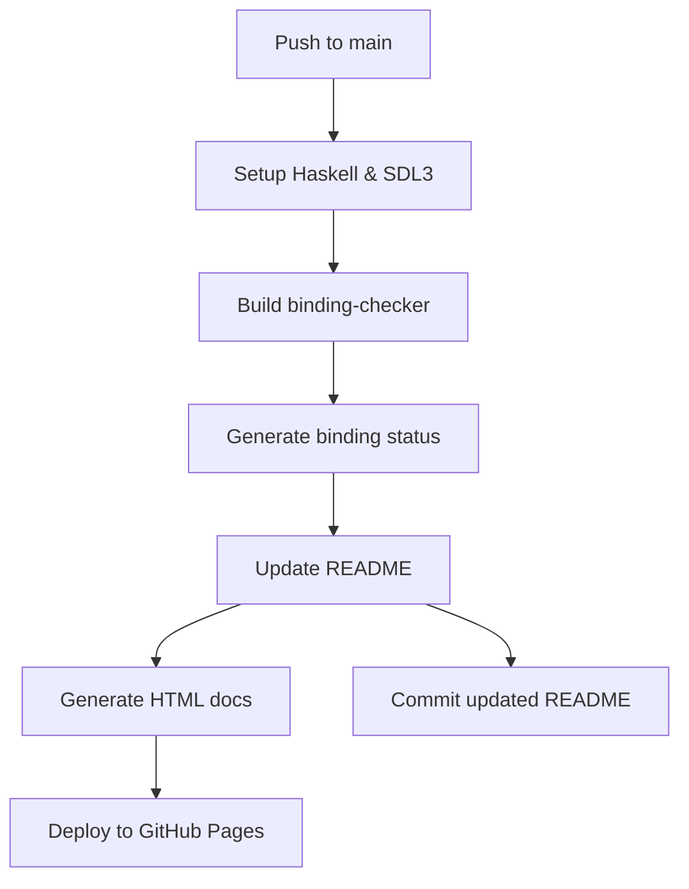

# GitHub Actions Integration Guide

This directory contains the complete GitHub Actions integration for SDL3 Haskell
bindings, providing automated binding status updates and documentation
deployment.

## 🚀 Quick Start

The GitHub integration is **fully automated** - simply push to the `main` branch
and everything happens automatically:

1. **SDL3 installation** (following README instructions)
2. **Binding status generation** (live analysis of all modules)
3. **README updates** (automatic binding status table)
4. **Documentation deployment** (GitHub Pages with custom styling)

## 📁 Directory Contents

| File                          | Purpose                                                     |
| ----------------------------- | ----------------------------------------------------------- |
| `workflows/deploy-readme.yml` | Main GitHub Actions workflow                                |
| `template.html`               | Haskell-themed Pandoc template for documentation            |
| `generate-binding-status.sh`  | Analyzes bindings and creates status tables                 |
| `update-readme.sh`            | Intelligently updates README with fresh status              |
| `validate.sh`                 | Complete validation script (replaces multiple test scripts) |

## ⚡ Quick Validation

Before pushing changes, run the validator:

```bash
./.github/validate.sh        # Quick validation
./.github/validate.sh full   # Comprehensive testing
```

This ensures all components are working correctly.

## 🔄 Workflow Process



## 📊 Binding Status Features

The automated binding status includes:

- **Real-time Analysis**: Current status of all 54+ SDL3 modules
- **Completion Metrics**: Overall progress and missing function counts
- **Visual Indicators**: ✅ Complete, ⚠️ Missing functions, ❌ No bindings
- **Timestamp**: When the analysis was last updated
- **Interactive Tools**: Links to binding checker tools

## 🛠️ Local Development

### Test Individual Components

```bash
# Generate binding status
./.github/generate-binding-status.sh

# Update README with current status
./.github/update-readme.sh

# Quick validation
./.github/validate.sh

# Full validation with functionality tests
./.github/validate.sh full
```

### Test Binding Checker

```bash
# Direct usage
cabal exec binding-checker

# Direct usage
cabal exec binding-checker
```

## 🎨 Documentation Styling

The HTML documentation uses a custom Haskell-themed design:

- **Colors**: Purple color scheme inspired by Haskell branding
- **Typography**: Professional font stack with excellent readability
- **Responsive**: Mobile-friendly layout
- **Accessibility**: High contrast and clear visual hierarchy

**Note**: The `template.html` file contains Pandoc template variables like
`$title$` and `$body$` which are not valid HTML by themselves. These get
substituted by Pandoc during HTML generation. The validation scripts check for
template structure, not HTML syntax.

## 📈 Status Indicators

| Symbol         | Meaning                                                     |
| -------------- | ----------------------------------------------------------- |
| ✅             | **Complete** - All functions from header are bound          |
| ⚠️ `X missing` | **Partial** - Header has bindings but X functions missing   |
| ❌             | **No bindings** - No Haskell bindings exist for this header |
| ❓             | **Unknown** - Status could not be determined                |

## 🔧 Troubleshooting

### Common Issues

**Build Fails**: Run validation to diagnose

```bash
./.github/validate.sh full  # Shows detailed error information
```

**Status Generation Fails**: Check SDL3 installation and binding checker

```bash
pkg-config --exists sdl3  # Should succeed
cabal build binding-checker  # Should build successfully
echo "/usr/local/include/SDL3/SDL_init.h" | cabal exec binding-checker  # Should work
```

**README Not Updated**: Check script permissions and git status

```bash
ls -la .github/*.sh  # Should show executable permissions
git status  # Check for uncommitted changes
```

**Template Issues**: Remember that `template.html` contains Pandoc variables,
not valid HTML

```bash
# This will fail - template.html is NOT valid HTML by itself
html5validator .github/template.html  # ❌ Will fail

# This works - validates template structure for Pandoc
grep -F '$title$' .github/template.html  # ✅ Should find template variables
pandoc --template=.github/template.html README.md  # ✅ Should generate valid HTML
```

## 🚦 GitHub Actions Status

Monitor the workflow execution:

1. Go to **Actions** tab in GitHub repository
2. Look for "Build and Deploy Readme with Binding Status" workflow
3. Check individual step logs for detailed information
4. Successful runs will update README and deploy documentation

## 🎯 Key Benefits

- **Zero Maintenance**: Completely automated updates
- **Always Current**: Binding status reflects latest code changes
- **Professional Docs**: Beautiful, accessible documentation
- **Developer Friendly**: Modern CLI tools integration
- **Transparent**: Clear status reporting and error handling
- **Simplified Testing**: Single validation script replaces multiple test
  scripts

## 🤝 Contributing

When contributing to SDL3 bindings:

1. Make your changes to binding files
2. Test locally with `cabal exec binding-checker`
3. Run `./.github/validate.sh` to ensure integration works
4. Push to main - GitHub Actions handles the rest!

The system will automatically:

- Detect new or changed bindings
- Update completion percentages
- Generate fresh documentation
- Deploy updated status to GitHub Pages

---

_This integration provides a seamless, maintenance-free solution for keeping
SDL3 binding documentation current and accessible._
